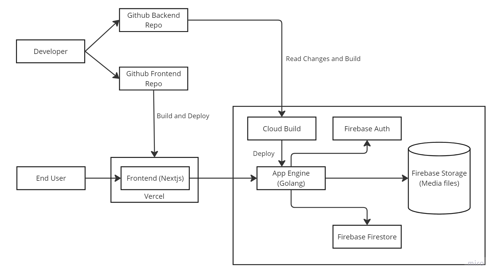
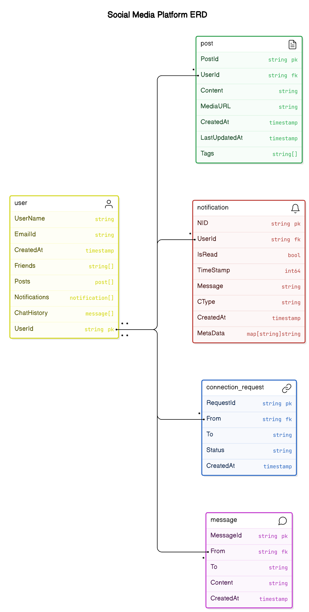

# Yet Another Social Media App (YASMP)

YASMP is a full-stack web application mimicking a simple social media site (similar to instagram, although nowhere close feature-wise), fully hosted on Google Cloud Platform, Firebase and Vercel. This project was undertaken as a demonstration of various skills: Web Development, Cloud Deployment/Hosting, CI/CD pipelining and Software and System design principles.

Visit the live site @[SocialMediaApp](https://social-media-app-frontend-two.vercel.app/)

## Tech Stack

### Frontend

- **Framework:** Next.js
- **Hosting:** Vercel

### Backend

- **API Hosting:** Google Cloud App Engine
- **Media Storage:** Firebase Storage
- **Authentication:** Firebase Auth
- **Database:** Firebase Firestore (NoSQL)

## Implementation Details

Choosing the right tech stack involves balancing ease of development, deployment costs, resource management, and performance. This project focuses on utilizing various services from Google Cloud Platform, particularly Firebase, to simplify development while maintaining scalability and performance.

### System Design



The system design is fairly straightforward and self-explanatory from the image.

The flow for a developer goes like this:

- develop locally
- commit & push changes to remote repo
- setup remote CI/CD pipeline for builds
- deploy builds

This flow is similar for backend and frontend with slight differences.

For an end user:

- request a page to frontend (app hosted on vercel).
- Vercel requests the required resources from backend through a request to Google App Engine.
- The Backend API uses services from firebase (Auth, Firestore, Storage) to fetch resources.
- The API endpoint sends a response back to vercel.
- Vercel uses the resources sent back in response to fill the contents in the page and sends it to the end user.

### Database Model and Design

Here is a model describing different entities:



### Frontend Stack

- **Framework:** Next.js  
  Next.js was chosen for its powerful features like Server-Side Rendering (SSR), automatic code splitting, and simplified routing, etc and also because I wanted to try out something new. These features make it an ideal choice for building fast, modern web applications.
- **Deployment:** Vercel  
  The app is deployed on Vercel, which offers seamless integration with Next.js, making deployment and scaling straightforward.

### Backend Stack

- **Database:** Firebase Firestore  
  Firestore is a NoSQL document-based database, similar to MongoDB. It's beginner-friendly yet powerful enough to scale with complex applications. Firestore also provides flexible "rules" for securing resources based on user permissions.
- **Authentication:** Firebase Auth  
  Firebase Auth was chosen for its seamless integration with other Firebase services. It simplifies the process of user authentication and authorization.
- **Media Storage:** Firebase Storage  
  Firebase Storage functions similarly to AWS S3. It provides easy-to-use SDKs for managing media and file storage, making it a good fit for handling user uploads like photos and videos.
- **API Endpoint:** Google App Engine  
   The backend's API is built with Golang and hosted on Google App Engine (GAE). Golang was chosen for its efficiency in building backend APIs. Google Cloud Build automates deployment, monitoring changes in the GitHub repository, and rebuilding the application via YAML configuration files.

### Few other setups (Firebase Access Rules and Cleaning Build files)

- Even though we take measures to provide role-based access to resources through gateways and API endpoints, its important to take measures to improve security. One such method is throough firebase access rules, which reads an incoming request (a direct request to DB) and check if the user is allowed to use certain resources. Let us explore some rules which allow users to perform reads, write, update or delete a resource.

When a request comes in for the user's document:

1. read request can be done if one of these is true:

- resource is a public
- requesting entity is requesting its own resource.
- resource is private AND requestor is a connection

2. write, update request can be done if:

- requesting entity is requesting its own resource.

Here is the code snippet showing all the rules:

```
match /users/{userId} {
     allow read: if resource.data.Visibility == 'public' ||
                 (request.auth != null && request.auth.uid == userId) ||
                 (resource.data.Visibility == 'private' &&
                 request.auth != null && request.auth.uid in resource.data.Friends);

     allow write, update: if request.auth != null && request.auth.uid == userId;
   }
```

Once we build files on cloud, it is also important to clean to unused/unnecessary files. With increasing number of files your cloud bills can skyrocket. In my project it is not necessary (No requirement) for me to retain old build or old versions of my app.

In my cloudbuild.yaml file, one of the steps after building is too list and delete alll other older version of the app. I also setup cloud trigger in my GCP cloud to automatically delete build images that have not been tagged with "latest".

```yaml
- name: "gcr.io/cloud-builders/gcloud"
    id: "list-old-versions"
    entrypoint: "bash"
    args:
      - "-c"
      - |
        # Store the current deployed version
        current_version=$(gcloud app versions list --hide-no-traffic --format="value(version.id)" --sort-by="~version.createTime" | head -n 1)
        # List and delete all old versions except the current one
        gcloud app versions list --format="value(version.id)" --filter="version.id != $current_version" | xargs -I {} gcloud app versions delete {} --quiet
```

## What I learnt and potential improvements

<b>Learning Experience</b>

Applications I build are usually built locally as PoC or partially on cloud with use of databases/services from AWS or GCP. But this project was fully deployed on cloud using various services like GCP, Firebase, Vercel, etc. I also experienced what it's like to handle a large codebase with multiple connected components. Error handling and debugging was simpler in local development, because all the components and services are talking within the same host, hence easier to track, log, view errors. But when your app is a split into 2 or more serives communicating with each other from a different host/location, things become complicated and challenging. Deconstructing request logs to a service is also something I learnt while building this application.

Using GCP for the first time, the experience was user and beginner friendly. The services, billing, etc are easily accesible with linear cost pricing. Using this helped me get a better understanding of services provided by AWS.

While this project is not built for massive scale and is more of a proof of concept (POC), there are several key improvements I would make if building this for scale:

<b>Mistakes and Areas for Improvement:</b>

1. <b>Too many REST/remote calls to complete an action:</b>

   Many actions require multiple remote calls which could be optimized. Reducing the total number of calls by batching or restructuring the flow would help improve performance.

2. <b>Large payloads from doc.Data():</b>

   The doc.Data() payload can get massive if the user's profile grows. This can lead to slower queries. In hindsight, separating some fields of the user document based on access patterns (e.g., separate collections for detailed data) would be a more scalable approach.

3. <b>Suboptimal database modeling:</b>

   While Firestore is flexible, my document structure could be optimized for search and retrieval. In a larger-scale app, the current model may lead to performance bottlenecks with increased query complexity.

<b>Considerations for Scaling:</b>

1. <b>Handling traffic during new deployments:</b>

   Rolling out new versions while handling traffic seamlessly is essential. Right now, new deployments could result in short downtime. Setting up canary deployments or blue-green deployment strategies could mitigate this issue.

2. <b>Code sanity and optimization with a growing codebase:</b>

   As the codebase and nested folder structure grows, maintaining code sanity and optimization will become a challenge. Regular refactoring, documentation, and maintaining modularity in the codebase would help.

3. <b>Frontend optimization:</b>

   Although SSR in Next.js helps with initial load times, some of the frontend components could benefit from lazy loading and code splitting at a more granular level to improve performance, especially for mobile users.

4. <b>Improving UI/UX for mobile:</b>

   While the app is mobile-responsive, there are still areas where user experience on smaller devices could be optimized, such as button placements and viewport handling.

5. <b>Error handling and logging:</b>

   Better error handling, including more comprehensive logs in both frontend and backend, would help with debugging and monitoring. Currently, certain errors might be silent or not logged adequately.

These improvements would take the project closer to production-ready quality for handling a larger user base.

## Links

- To see the frontend implementation in Next.js, visit the [Frontend Repository](https://github.com/ashvegeta/SocialMediaApp-Frontend).
