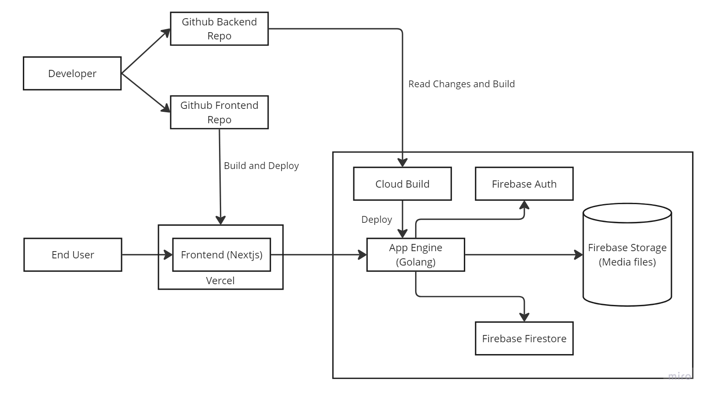

# Yet Another Social Media App (YASMP)

A full-stack web application mimicking a simple social media site, fully hosted on Google Cloud.  
Visit the live site: [SocialMediaApp](https://social-media-app-frontend-two.vercel.app/)

## Tech Stack

### Frontend

- **Framework:** Next.js
- **Hosting:** Vercel

### Backend

- **API Hosting:** Google Cloud App Engine
- **Media Storage:** Firebase Storage
- **Authentication:** Firebase Auth
- **Database:** Firebase Firestore (NoSQL)

## Implementation Details

Choosing the right tech stack involves balancing ease of development, deployment costs, resource management, and performance. This project focuses on utilizing various services from Google Cloud Platform, particularly Firebase, to simplify development while maintaining scalability and performance.

### System Design

### Frontend Stack

- **Framework:** Next.js  
  Next.js was chosen for its powerful features like Server-Side Rendering (SSR), automatic code splitting, and simplified routing. These features make it an ideal choice for building fast, modern web applications.
- **Deployment:** Vercel  
  The app is deployed on Vercel, which offers seamless integration with Next.js, making deployment and scaling straightforward.

### Backend Stack

- **Database:** Firebase Firestore  
  Firestore is a NoSQL document-based database, similar to MongoDB. It's beginner-friendly yet powerful enough to scale with complex applications. Firestore also provides flexible "rules" for securing resources based on user permissions.
- **Authentication:** Firebase Auth  
  Firebase Auth was chosen for its seamless integration with other Firebase services. It simplifies the process of user authentication and authorization.
- **Media Storage:** Firebase Storage  
  Firebase Storage functions similarly to AWS S3. It provides easy-to-use SDKs for managing media and file storage, making it a good fit for handling user uploads like photos and videos.
- **API Endpoint:** Google App Engine  
  The backend is built with Golang and hosted on Google App Engine (GAE). Golang was chosen for its efficiency in building backend APIs. Google Cloud Build automates deployment, monitoring changes in the GitHub repository, and rebuilding the application via YAML configuration files.

## Links

- To see the frontend implementation in Next.js, visit the [Frontend Repository](https://github.com/ashvegeta/SocialMediaApp-Frontend).
